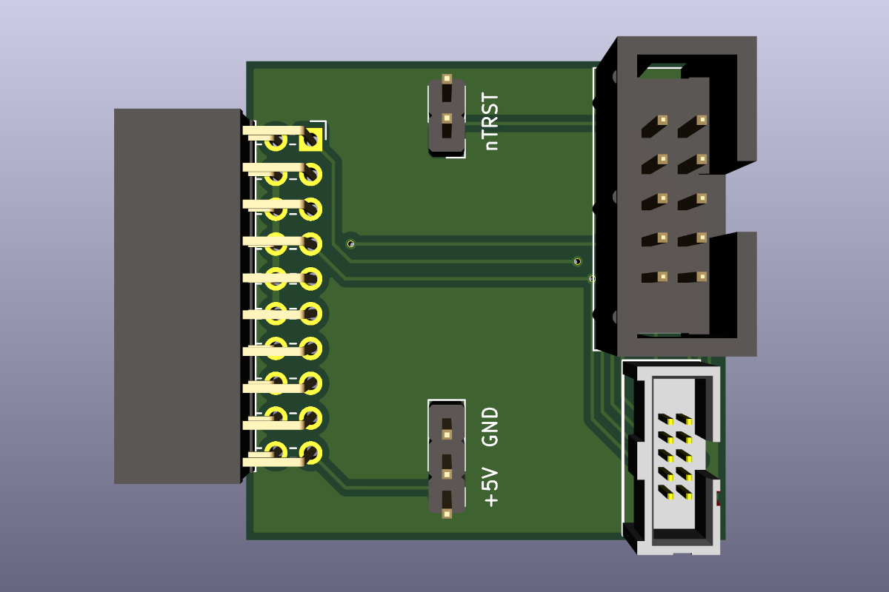

# Segger J-Link to Tag-Connect TC2050 adapter 

It follows standard JTAG/SWD pinout used on many Cortex-M boards. 
You can make your own boards using <a href="TLink.zip">this gerber file</a>.

Features:
- IDC 20 (0.10") connector for Segger J-Link
- IDC 10 (0.10") connector for Tag-Connect TC2050-IDC or TC2050-IDC-NL
- IDC 10 (0.05") connector for Tag-Connect TC2050-IDC-050, TC2050-IDC-050-ALL, TC2050-IDC-NL-050, TC2050-IDC-NL-050-ALL or directly to JTAG/SWD header
- Jumper to connect pin 5 to +5V or GND
- Jumper to connect pin 9 to nTRST

Tag-Connect TC2050-IDC-050 and TC2050-IDC-NL-050 have no pins 5 and 9 connected, so the jumpers do nothing for these two cables.
